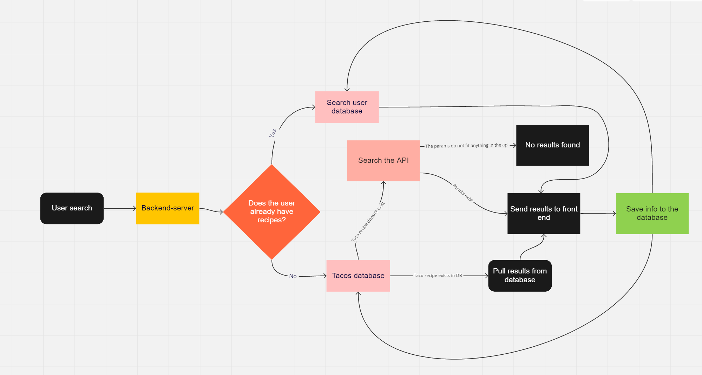

# Welcome to tacoBout
### The fully deployed web app to help you find the perfect taco recipe for your Tuesday, or any other day of the week.
 

### With help from the  API

# Cooperation Plan
Every person on your team is an asset. This is your chance to discover the hidden strengths and areas for growth for each team member.

### Trello 
- https://trello.com/b/X6mRHLmV/tacobout 

## Team Members
- Tim Egorov
- Skyler Johnson
- Anthony Johnson
- Hunter Britten

Describe at least:

- What are the key strengths of each person on the team?
  - Anothony
    1. Good at darts
    2. Goffer
    3. Consistency

  - Tim
    1. Project Management
    2. Sales / Presenting
    3. Communication

  - Skyler
    1. Staying the course
    2. Pushing through
    3. Good laughs

  - Hunter
    1. Positivity
    2. Git flow
    3. Functionality
    4. Bootstrap

- How can you best utilize these strengths in the execution of your project?
  - Put team members on where they go best.
  - Collaboration / pair programming with circle backs
  - 

- In which professional competencies do you each want to develop greater strength?
  - Anthony - craft
  - Tim - time management
  - Skyler - organization/project execution
  - Hunter - craft

- Knowing that every person in your team needs to understand all aspects of the project, how do you plan to approach the day-to-day work?
  - 9-6 working hours with hourly circle backs and merges of code to go over changes. Make sure during these everyone know what the code looks like so they know where to go and what to do next.

# Conflict Plan

Your team should agree on a process for handing disagreements, should they arise. It is better to have a plan in place ahead of time so you can all refer back to it when necessary.

Describe at least:

What will be your group’s process to resolve conflict, when it arises?
- Dispute about code writing - put to a vote. Majority rule. JB as tiebreaker. Everyday morning meeting will allow time to address any conflicts. Group mediation.

What will your team do if one person is taking over the project and not letting the other members contribute?
1. How's it going? How're you doing?
2. Is this a coding or personal issue?
3. If code, TA assistance / possible emergency meeting.
4. Plan/delegation adjustments

How will you approach each other and the challenges of the project knowing that it is impossible for all members to be at the exact same place in understanding and skill level?
Talk it out and teach each other. Pair program to bring everyone up as close to the same level as possible.
How will you raise concerns to members who are not adequately contributing?
1. How's it going? How're you doing?
2. Is this a coding or personal issue?
3. If code, TA assistance / possible emergency meeting.
4. Plan/delegation adjustments

How and when will you escalate the conflict if your resolution attempts are unsuccessful?
- Bring unresolvable conflict to JB

# Communication Plan

Before beginning to tackle the project, determine how your group will communicate with each other. This is not an individual effort. Make sure everyone feels comfortable with the identified methods of speaking up.

Describe at least:

What hours will you be available to communicate?
- 9-6 required more depending on teammember

What platforms will you use to communicate (ie. Slack, phone …)?
- Slack with notifs enabled
- Remo for meetings and pair programming

How often will you take breaks?
- Every hour if we remember
- 
What is your plan if you start to fall behind?
- Emergency team meeting
- 
How will you communicate after hours and on the weekend?
- Slack
- 
What is your strategy for ensuring everyone’s voice is heard?
- Communication Manager: Tim Egorov

How will you ensure that you are creating a safe environment where everyone feels comfortable speaking up?
- It's the communication manager's job to ensure the safe environment and encourage participation from all group members.

# Work Plan

Explain your work plan to track whether everyone is contributing equally to all parts of the project, and that each person is working on “meaty” problems. This should prevent “lone wolf” efforts and “siloed” efforts.

Describe at least:

How you will identify tasks, assign tasks, know when they are complete, and manage work in general?
What project management tool will be used?
- Daily review of tasks. Members bring up tasks they might have uncovered and redelegate the workload if needed.

Initially, we will agree upon an MVP and focus on building out the core tasks first.

We will be using Trello board to track all of our work. In the morning meeting we will review our project status and the project manager will drive and clean up the space if needed. All task details will live in Trello.

Project Manager: Hunter Britten

# Git Process

Plan out what your team’s Git workflow looks like for coding tasks.

Describe at least:

What components of your project will live on GitHub?
- All finished components will live in github.

How will you share the repository with your teammates?
- We've created an organization that includes all members of our team. Here we can see all of our work.

What is your Git flow?
- PR at the end of the day for what you worked on.

Merge as a group the next morning. Group `git pull`

Will you be using a PR review workflow? If so, consider:
How many people must review a PR?
- Merging to the origin main will require everyone to review. Merging to a branch will require only 2 members.

Who merges PRs?
- Not the person who did the PR.

How often will you merge?
- Every day minus weekends unless agreed upon by members

How will you communicate that it’s time to merge?
- Daily standup merging as a group. Outside of daily standup, communicate via Slack.

### Domain Model

# Getting Started with Create React App

This project was bootstrapped with [Create React App](https://github.com/facebook/create-react-app).

## Available Scripts

In the project directory, you can run:

### `npm start`

Runs the app in the development mode.\
Open [http://localhost:3000](http://localhost:3000) to view it in the browser.

The page will reload if you make edits.\
You will also see any lint errors in the console.

### `npm test`

Launches the test runner in the interactive watch mode.\
See the section about [running tests](https://facebook.github.io/create-react-app/docs/running-tests) for more information.

### `npm run build`

Builds the app for production to the `build` folder.\
It correctly bundles React in production mode and optimizes the build for the best performance.

The build is minified and the filenames include the hashes.\
Your app is ready to be deployed!

See the section about [deployment](https://facebook.github.io/create-react-app/docs/deployment) for more information.

### `npm run eject`

**Note: this is a one-way operation. Once you `eject`, you can’t go back!**

If you aren’t satisfied with the build tool and configuration choices, you can `eject` at any time. This command will remove the single build dependency from your project.

Instead, it will copy all the configuration files and the transitive dependencies (webpack, Babel, ESLint, etc) right into your project so you have full control over them. All of the commands except `eject` will still work, but they will point to the copied scripts so you can tweak them. At this point you’re on your own.

You don’t have to ever use `eject`. The curated feature set is suitable for small and middle deployments, and you shouldn’t feel obligated to use this feature. However we understand that this tool wouldn’t be useful if you couldn’t customize it when you are ready for it.

## Learn More

You can learn more in the [Create React App documentation](https://facebook.github.io/create-react-app/docs/getting-started).

To learn React, check out the [React documentation](https://reactjs.org/).

### Code Splitting

This section has moved here: [https://facebook.github.io/create-react-app/docs/code-splitting](https://facebook.github.io/create-react-app/docs/code-splitting)

### Analyzing the Bundle Size

This section has moved here: [https://facebook.github.io/create-react-app/docs/analyzing-the-bundle-size](https://facebook.github.io/create-react-app/docs/analyzing-the-bundle-size)

### Making a Progressive Web App

This section has moved here: [https://facebook.github.io/create-react-app/docs/making-a-progressive-web-app](https://facebook.github.io/create-react-app/docs/making-a-progressive-web-app)

### Advanced Configuration

This section has moved here: [https://facebook.github.io/create-react-app/docs/advanced-configuration](https://facebook.github.io/create-react-app/docs/advanced-configuration)

### Deployment

This section has moved here: [https://facebook.github.io/create-react-app/docs/deployment](https://facebook.github.io/create-react-app/docs/deployment)

### `npm run build` fails to minify

This section has moved here: [https://facebook.github.io/create-react-app/docs/troubleshooting#npm-run-build-fails-to-minify](https://facebook.github.io/create-react-app/docs/troubleshooting#npm-run-build-fails-to-minify)
