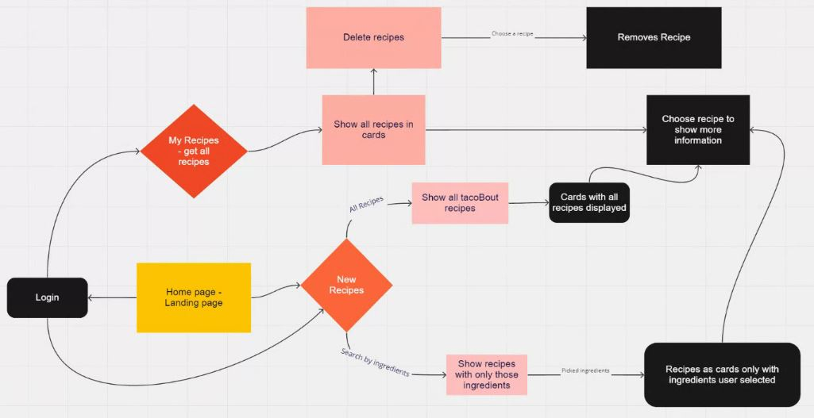

## What is the vision of this product?

On the most basic level, tacoBout sells happiness. Our product creates an unparalleled symbiosis of user experience and recipe generation that ensures a unique dining experience for each and every meal.

## What pain point does this project solve?

Ensuring each Taco Tuesday is as fresh as our ingredients. 

## Why should we care about your product?

### Scope (In/Out)

- IN - What will your product do:
  - This app will provide taco recipes to the user
  - This app will obtain information about what ingredients the user has, and list recipes containing those ingredients
  - The user will be able to store their favorite recipes
  - The user will be able to browse and manage their saved recipes

- OUT - What will your product not do.
  - The app will not show non-taco foods
  - The app will not be available on Android
  - The app will not allow users to add their own recipes

## Minimum Viable Product

Our MVP will allow a user to enter certain ingredients, and receive recipes based on those ingredients. They will also be able to search the database for recipes, and save recipes they like. Users will also be able to log in.

## Stretch Goals

- Allow users to 'favorite' or rate recipes in their saved folder
- Show a "recipe of the day"
- Add lots and lots of ingredients (MVP will only show 5-10)
- Add recipes besides tacos

## List the functionality of your product. This will consist of tasks such as the following:

- A user can search for taco recipes depending on ingredient
- A user can log in using Auth0
- An admin can determine which recipes are listed (narrow searches to recipes with images, for example)

## Data Flow

## Non-Functional Requirements

> Non-functional requirements are requirements that are not directly related to the functionality of the application but still important to the app.

> Examples include:
> - Security
> - Usability
> - Testability

>Pick 2 non-functional requirements and describe their functionality in your application.

1. Scalability. Our app is easily able to scale from its MVP state. We are able to add ingredients that a user can search by, including ingredients that might not normally be found in tacos. In addition, we can relatively easily add non-taco recipes and scale the app accordingly.
2. Usability. Our app's user experience is easy and straightforward. The implementation of photos will improve the user experience. By clicking ingredients they might already have, the user will have a better time using our app than simply searching for a recipe online.
